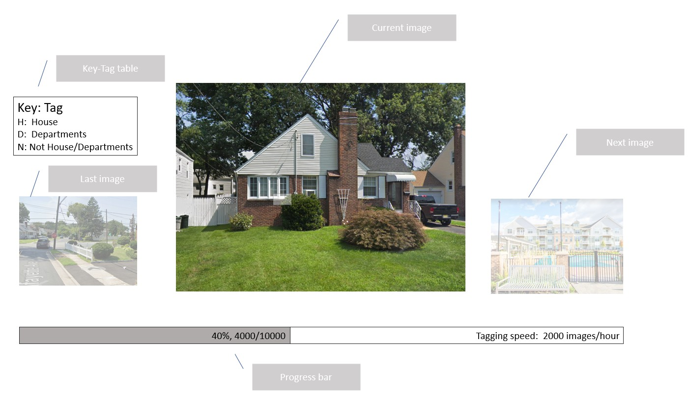

# Tagme

1. Design a cross-platform(Windows/Ubuntu) software, named "Tagme", to tag images.

2. Tagme is highly optimized on tagging images. For example, the pre-defined tags can be mapped to keys in the computer keyboard. A user can asign a tag to an image by samply hitting a key, then Tagme automatically show the next image. So all the user needs to do is only hitting a key to indicate the tag of the showing image. This is no other operation such as zoomming or moving to the next images.

Fox example, 10,000 street view images need to be classified as House, Departments, and Non_house_departments. Tagme show a House image in UI and the annotator hit key "H", Tagme will store "House" in somewhere, associating the path and the file name of the image. Then Tagme shows another image. All the annotator needs to do is click the keys mapped to the tags. No other operation of mouse movements are required.

3. Tips:
  1) The use can decide show the tag-key table not not.
  2) Storing the data into text file rather than database.
  3) How to save and open projects needs to be considered carefully.
  4) Can Tagme run in a brower?
  5) Tagging speed is highly emphasized. Please let Tagme do everything it can do. Annotators only do things humman can do, e.g., select tags for images in this case.
  6) Asigning multiple tags is supported. The annotator can also write down notes for a image. In these situations, Tagme will not move to the next image automatically.
  7) Key-Tags are pre-defined in a text file.
  8) The time used for each image should be stored. E.g., an annotator spends 1 second on a image, Tagme should store "1 second" associating with this image.
  

The UI of Tagme shoule looks like this:

